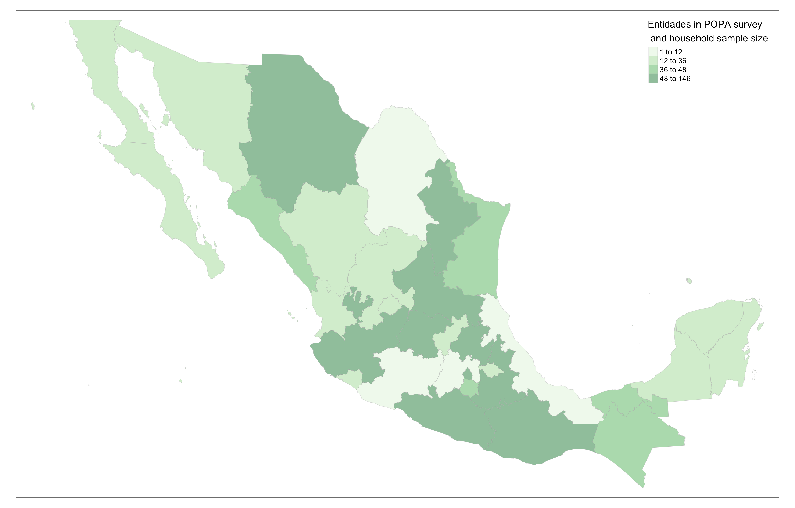
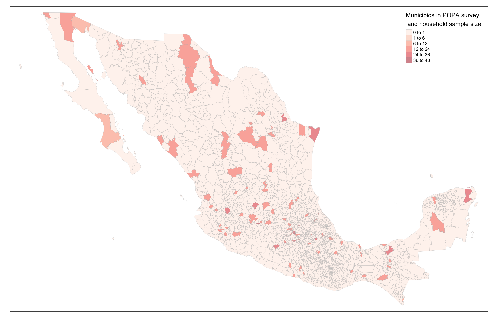

How we obtained the Sample WSS Operators Mexico and what it looks like


```
## [1] TRUE TRUE TRUE
```


```
## [1] TRUE TRUE
```


## Sources of Data

1. The sample for the survey is mutuated from the sampling design of LAPOP

I looked into the STATA files with the sample of MX - 2016 which surveyd 1,563 IDs located in 260 **clusters** , which covered 110 **municipios** (since samples are proportional to the size of the population, larger municipios have more than one PSU (es Tijuana has 61 & 62))

LAPOP provided a file with geofences that indicate a circle containing each cluster in 2016 (slightly changed in 2018) 

2. In order to match official admin boundaries and shapefile (as in Census 2010), I downloaded from INEGI the ID keys and shapefiles (polygons) for  
+ Entidad (32) 
+ Municipios (2546)
+ Localidades URb( 4525 of 192,217 ) MULTiPOLYGON
+ Localidades Rur (187719 of 192,217) points 
+ AGEB urb- 56195 
 
3. Identification of (expected) clusters for POPA 2018 sample (based on LAPOP) & matching to INEGI keys admin boundaries (names and shapes)
	--> saved POPA Cluster size by Admin Bound in 
	--> saved SPJOIN RESULTS LAPOP FENCES intersected with Mun (Centroids and fences) 
	 

## Which Entidades and Municipios

The ENTIDADES and MUNICIPIOS INCLUDING LAPOP/POPA clusters (2016 --> closely followed in 2018)


	


 


 


## Changes occurred between 2000-2010

Look at Changes in ENTIDADES and MUNICIPIOS covered by LAPOP/POPA clusters according to census 2010 compared to census 2000


......


## The Water & Sanitation Providers 

Look at THE WATER & SANITATION SERVICE PROVIDERS - SPECIFICALLY IN THE SURVEY AREA

INEGI has identified a total of 2688 _"prestadores"_ in the _"Censo de Captacion, Tratamiento y Suministro de Agua"_ 
conducted in 2014 and published in 2015. Of all of these, some 700 could be rightly defined as _"organismos operadores"_, i.e. 
entities specialized in the provision of the services of water and sanitation (regardless of their degree of autonomy in their 
decision making and financial management.

The service providers *"prestadores de los servicios de agua y saneamiento"* in Mexico are extremely heterogeneous in nature and conditions. 

In this project, the classification that we use is mostly derived from a _Nota Tecnica_ prepared by some colleagues of the IADB, WSA division [See @riquelme_organismos_2018, pp. 1-3]. This tracks some key information on **2,251 Prestadores**. 


Table: Title of the table

                                             Freq       % Valid   % Valid Cum.       % Total   % Total Cum.
------------------------------------------  -----  ------------  -------------  ------------  -------------
No clasificado                               1332    59.1737006       59.17370    59.1737006       59.17370
OPD paramunicipal                             594    26.3882719       85.56197    26.3882719       85.56197
Servicio Centralizado del Municipio           245    10.8840515       96.44602    10.8840515       96.44602
OPD paraestatal                                58     2.5766326       99.02266     2.5766326       99.02266
Concesionario privado                          10     0.4442470       99.46690     0.4442470       99.46690
Organismo Desconcentrado del ayuntamiento       7     0.3109729       99.77788     0.3109729       99.77788
Organismo Desconcentrado de la entidad          2     0.0888494       99.86673     0.0888494       99.86673
Operador federal                                2     0.0888494       99.95558     0.0888494       99.95558
Empresa publico-privada                         1     0.0444247      100.00000     0.0444247      100.00000
Todos los tipos                                 0     0.0000000      100.00000     0.0000000      100.00000
<NA>                                            0            NA             NA     0.0000000      100.00000
Total                                        2251   100.0000000      100.00000   100.0000000      100.00000


### REFERENCE


```r
# knitr::knit2html('./MexicoWaterSurvey/sample.Rmd',encoding = 'UTF-8',force_v1 = TRUE)
```

